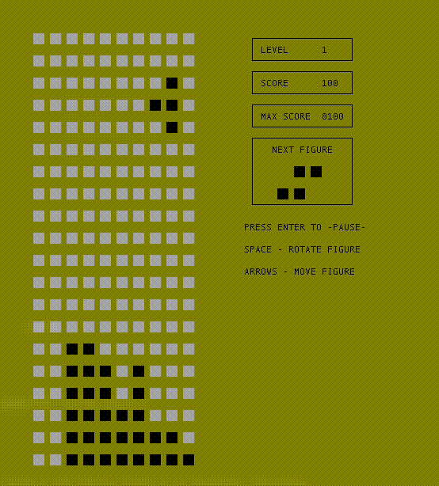

# BrickGame v1.0 Тетрис

Реализация игры «Тетрис» на языке программирования С с использованием структурного подхода.



## Содержание

1. [Информация](#информация)
2. [Спецификация и общая механика](#спецификация)
3. [Начисление очков](#начисление-очков)
4. [Механика уровней](#механика-уровней)

## Информация

Проект состоит из двух частей: библиотеки, реализующей логику работы игры, и терминального интерфейса, разработанного с использованием библиотеки `ncurses`. Логика работы библиотеки реализована с использованием конечных автоматов.

Для формализации логики данной игры используется следующий вариант конечного автомата:


Данный КА состоит из следующих состояний:

- START — состояние, в котором игра ждет, пока игрок нажмет кнопку готовности к игре.
- SPAWN — состояние, в которое переходит игра при создании очередного блока и выбора следующего блока для спавна.
- MOVING — состояние в котором блок движется вниз.
- SHIFTING — состояние, в котором блок движется по горизонтали.
- ROTATING - состояние, в котором блок вращается.
- ATTACHING — состояние, в которое преходит игра после «соприкосновения» текущего блока с уже упавшими или с землей. Если образуются заполненные линии, то она уничтожается и остальные блоки смещаются вниз. Если блок остановился в самом верхнем ряду, то игра переходит в состояние «игра окончена».
- GAVEOVER — игра окончена.

## Спецификация

Тебе необходимо реализовать программу BrickGame v1.0 aka Tetris:

- Программа разработана на языке Си стандарта C11 с использованием компилятора gcc.
- Программа состоит из двух частей: библиотеки, реализующей логику игры тетрис, и терминального интерфейса с использованием библиотеки `ncurses`.
- Для формализации логики игры использован конечный автомат.
- Сборка программы настроена с помощью Makefile со стандартным набором целей для GNU-программ: all, install, uninstall, clean, dvi, dist, test, gcov_report. Установка должна вестись в любой другой произвольный каталог.
- Программа разработана в соответствии с принципами структурного программирования.
- Обеспечено покрытие библиотеки unit-тестами, с помощью библиотеки `check` (тесты должны проходить на ОС Darwin/Ubuntu). Покрытие библиотеки с логикой игры тестами должно составлять не меньше 80 процентов.
- В игре присутствуют следующие механики:
  - Вращение фигур;
  - Перемещение фигуры по горизонтали;
  - Ускорение падения фигуры (при нажатии кнопки фигура перемещается до конца вниз);
  - Показ следующей фигуры;
  - Уничтожение заполненных линий;
  - Завершение игры при достижении верхней границы игрового поля;
  - подсчет очков;
  - хранение максимального количества очков.

- Для управления добавлена поддержка всех кнопок, предусмотренных на физической консоли:
  - Начало игры (ENTER),
  - Пауза (ENTER),
  - Завершение игры (ESC),
  - Стрелка влево — движение фигуры влево,
  - Стрелка вправо — движение фигуры вправо,
  - Стрелка вниз — падение фигуры,
  - Стрелка вверх — ни используется в данной игре,
  - Действие (вращение фигуры) (SPACE).
- Игровое поле соответствует размерам игрового поля консоли — десять «пикселей» в ширину и двадцать «пикселей» в высоту.
- Интерфейс библиотеки должен соответствовать описанию, которое находится в [library-specification.md](materials/library-specification.md).

### Начисление очков

Начисление происходит следующим образом:

- 1 линия — 100 очков;
- 2 линии — 300 очков;
- 3 линии — 700 очков;
- 4 линии — 1500 очков.

### Механика уровней

Каждый раз, когда игрок набирает 600 очков, уровень увеличивается на 1. Повышение уровня увеличивает скорость движения фигур. Максимальное количество уровней — 10.

## Сборка

- перейти в `src`
- для сборки лаунчера используйте команду `make install`
- для сборки и автозапуска используйте `make`

## Юнит тесты

- перейти в `src`
- запустить команду `make test`

```SHELL
Running suite(s): test_matrix
100%: Checks: 1, Failures: 0, Errors: 0

Running suite(s): test_fsm
100%: Checks: 54, Failures: 0, Errors: 0

Running suite(s): test_attaching
100%: Checks: 28, Failures: 0, Errors: 0

Running suite(s): test_attaching_figure
100%: Checks: 28, Failures: 0, Errors: 0

Running suite(s): test_move_left
100%: Checks: 28, Failures: 0, Errors: 0

Running suite(s): test_move_right
100%: Checks: 28, Failures: 0, Errors: 0

Running suite(s): test_move_left_shift
100%: Checks: 56, Failures: 0, Errors: 0

Running suite(s): test_move_right_shift
100%: Checks: 56, Failures: 0, Errors: 0

Running suite(s): test_rotaite
100%: Checks: 30, Failures: 0, Errors: 0

Running suite(s):100%: Checks: 0, Failures: 0, Errors: 0

Total: 309
Failed: 0
Passed: 309
```

## LCOV report

- перейти в `src`
- запустить команду `make gcov_report`


